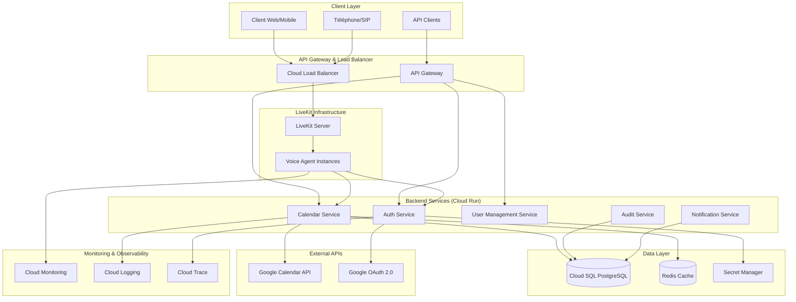
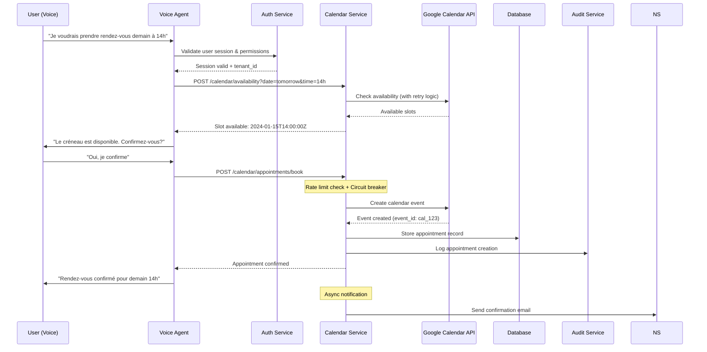

# Architecture Technique Complète - Système d'Agent Conversationnel Multi-Tenant avec Google Calendar

## Table des Matières

1. [Vue d'Ensemble de l'Architecture](#1-vue-densemble-de-larchitecture)
2. [Spécification Technique Détaillée des Composants](#2-spécification-technique-détaillée-des-composants)
3. [Flow Détaillé - Création de Rendez-vous](#3-flow-détaillé---création-de-rendez-vous)
4. [Patterns de Sécurité OAuth 2.0 et Token Management](#4-patterns-de-sécurité-oauth-20-et-token-management)
5. [Résilience et Gestion d'Erreurs](#5-résilience-et-gestion-derreurs)
6. [Extension du Code Existant](#6-extension-du-code-existant)
7. [Stratégies de Mise à l'Échelle et Monitoring](#7-stratégies-de-mise-à-léchelle-et-monitoring)
8. [Bonnes Pratiques et Pièges à Éviter](#8-bonnes-pratiques-et-pièges-à-éviter)
9. [Plan de Déploiement et Migration](#9-plan-de-déploiement-et-migration)

---

## 1. Vue d'Ensemble de l'Architecture

### Architecture Système Complète



### Caractéristiques Techniques Clés

- **Scalabilité**: Support de 100 utilisateurs simultanés extensible à 10,000+
- **Résilience**: Circuit breakers, retry logic, failover automatique
- **Sécurité**: OAuth 2.0, chiffrement end-to-end, isolation multi-tenant
- **Conformité**: RGPD, audit trail complet, anonymisation des données
- **Performance**: Cache Redis, optimisations rate limiting, monitoring temps réel

---

## 2. Spécification Technique Détaillée des Composants

### 2.1 LiveKit Voice Agent (Extension de votre code existant)

**Responsabilités :**
- Gestion des sessions vocales multi-tenant
- Orchestration des function tools
- Gestion de l'état de conversation par utilisateur
- Interface avec les services backend

**Interfaces :**
- WebRTC pour audio/vidéo
- REST API vers Calendar Service
- WebSocket pour real-time updates

**Technologies :**
- LiveKit Agents 1.1+
- OpenAI GPT-4o-mini
- Deepgram Nova-3 STT
- ElevenLabs TTS

### 2.2 Auth Service (Cloud Run)

**Responsabilités :**
- Gestion OAuth 2.0 Google Calendar
- Refresh automatique des tokens
- Validation des permissions par tenant
- Session management multi-tenant

**API Endpoints :**
```python
POST /auth/oauth/initiate
POST /auth/oauth/callback
POST /auth/token/refresh
GET /auth/user/permissions
DELETE /auth/user/revoke
```

**Technologies :**
- FastAPI/Flask
- Google OAuth 2.0 Client Library
- Redis pour cache de tokens
- Cloud Secret Manager

### 2.3 Calendar Service (Cloud Run)

**Responsabilités :**
- Intégration Google Calendar API
- Gestion des rate limits et retry logic
- Cache des disponibilités
- Validation des créneaux

**API Endpoints :**
```python
POST /calendar/appointments/book
PUT /calendar/appointments/{id}/reschedule
DELETE /calendar/appointments/{id}/cancel
GET /calendar/availability
GET /calendar/appointments/list
```

**Technologies :**
- Google Calendar API v3
- Circuit Breaker Pattern
- Rate Limiting distribué
- Cache Redis pour disponibilités

### 2.4 User Management Service (Cloud Run)

**Responsabilités :**
- Gestion multi-tenant
- Profils utilisateurs et permissions
- Configuration par cabinet/organisation
- Gestion des quotas

**Schéma de Base de Données :**
```sql
-- Tenants (cabinets/organisations)
CREATE TABLE tenants (
    id UUID PRIMARY KEY DEFAULT gen_random_uuid(),
    name VARCHAR(255) NOT NULL,
    domain VARCHAR(255) UNIQUE,
    settings JSONB,
    created_at TIMESTAMP DEFAULT NOW(),
    updated_at TIMESTAMP DEFAULT NOW()
);

-- Utilisateurs
CREATE TABLE users (
    id UUID PRIMARY KEY DEFAULT gen_random_uuid(),
    tenant_id UUID REFERENCES tenants(id),
    email VARCHAR(255) NOT NULL,
    first_name VARCHAR(100),
    last_name VARCHAR(100),
    phone VARCHAR(20),
    is_active BOOLEAN DEFAULT true,
    created_at TIMESTAMP DEFAULT NOW(),
    updated_at TIMESTAMP DEFAULT NOW(),
    UNIQUE(tenant_id, email)
);

-- Permissions granulaires
CREATE TABLE user_permissions (
    id UUID PRIMARY KEY DEFAULT gen_random_uuid(),
    user_id UUID REFERENCES users(id),
    tenant_id UUID REFERENCES tenants(id),
    permissions JSONB NOT NULL,
    is_active BOOLEAN DEFAULT true,
    created_at TIMESTAMP DEFAULT NOW(),
    updated_at TIMESTAMP DEFAULT NOW(),
    UNIQUE(user_id, tenant_id)
);

-- OAuth tokens (chiffrés)
CREATE TABLE oauth_tokens (
    id UUID PRIMARY KEY DEFAULT gen_random_uuid(),
    user_id UUID REFERENCES users(id),
    tenant_id UUID REFERENCES tenants(id),
    encrypted_token TEXT NOT NULL,
    encrypted_refresh_token TEXT NOT NULL,
    expiry TIMESTAMP,
    created_at TIMESTAMP DEFAULT NOW(),
    updated_at TIMESTAMP DEFAULT NOW(),
    UNIQUE(user_id, tenant_id)
);

-- Rendez-vous
CREATE TABLE appointments (
    id UUID PRIMARY KEY DEFAULT gen_random_uuid(),
    tenant_id UUID REFERENCES tenants(id),
    user_id UUID REFERENCES users(id),
    google_event_id VARCHAR(255) NOT NULL,
    title VARCHAR(255),
    description TEXT,
    start_time TIMESTAMP NOT NULL,
    end_time TIMESTAMP NOT NULL,
    status VARCHAR(50) DEFAULT 'confirmed',
    patient_name VARCHAR(255),
    patient_email VARCHAR(255),
    patient_phone VARCHAR(20),
    created_at TIMESTAMP DEFAULT NOW(),
    updated_at TIMESTAMP DEFAULT NOW(),
    INDEX(tenant_id, start_time),
    INDEX(user_id, start_time),
    INDEX(google_event_id)
);
```

### 2.5 Audit Service (Cloud Run)

**Responsabilités :**
- Logging de toutes les actions
- Conformité RGPD
- Traçabilité des modifications
- Rapports d'audit

**Schéma d'Audit :**
```sql
CREATE TABLE audit_log (
    id UUID PRIMARY KEY DEFAULT gen_random_uuid(),
    tenant_id UUID NOT NULL,
    user_id UUID,
    action VARCHAR(100) NOT NULL,
    resource_type VARCHAR(50) NOT NULL,
    resource_id VARCHAR(255),
    details JSONB,
    ip_address INET,
    user_agent TEXT,
    timestamp TIMESTAMP DEFAULT NOW(),
    INDEX(tenant_id, timestamp),
    INDEX(user_id, timestamp),
    INDEX(action, timestamp)
);
```

---

## 3. Flow Détaillé - Création de Rendez-vous

### Diagramme de Séquence



### Gestion d'Erreurs et Fallbacks

```python
# Exemple de gestion d'erreurs dans le flow
async def handle_appointment_booking_flow(
    user_input: str,
    tenant_id: str,
    user_id: str
) -> str:
    try:
        # 1. Validation des permissions
        if not await check_user_permissions(user_id, tenant_id, [CalendarPermission.WRITE_CALENDAR]):
            return "Vous n'avez pas les permissions nécessaires pour réserver un rendez-vous."
        
        # 2. Parsing de la demande
        appointment_details = await parse_appointment_request(user_input)
        if not appointment_details:
            return "Je n'ai pas pu comprendre votre demande. Pouvez-vous préciser la date et l'heure souhaitées ?"
        
        # 3. Vérification de disponibilité
        availability = await check_availability(
            tenant_id, 
            appointment_details['datetime']
        )
        
        if not availability['available']:
            alternatives = availability.get('alternatives', [])
            if alternatives:
                alt_text = ", ".join([f"{alt['date']} à {alt['time']}" for alt in alternatives[:3]])
                return f"Ce créneau n'est pas disponible. Je peux vous proposer : {alt_text}"
            else:
                return "Aucun créneau disponible à cette période. Souhaitez-vous une autre date ?"
        
        # 4. Création du rendez-vous
        appointment = await create_appointment(
            tenant_id=tenant_id,
            user_id=user_id,
            appointment_data=appointment_details
        )
        
        # 5. Confirmation
        return f"Rendez-vous confirmé pour le {appointment['date']} à {appointment['time']}. Référence : {appointment['id']}"
        
    except RateLimitExceeded:
        return "Le service est temporairement surchargé. Veuillez réessayer dans quelques instants."
    
    except CalendarServiceUnavailable:
        # Fallback : enregistrer la demande pour traitement manuel
        await queue_appointment_request(tenant_id, user_id, user_input)
        return "Le service de réservation est temporairement indisponible. Votre demande a été enregistrée et sera traitée dès que possible."
    
    except Exception as e:
        logger.error(f"Unexpected error in appointment booking: {e}")
        await log_error_for_investigation(tenant_id, user_id, str(e))
        return "Une erreur technique s'est produite. Un membre de l'équipe va vous recontacter rapidement."
```

---

## 4. Patterns de Sécurité OAuth 2.0 et Token Management

### 4.1 Architecture OAuth 2.0 Sécurisée

```python
# auth_service/oauth_manager.py
import asyncio
import time
import random
from typing import Optional, Dict, Any
from google.oauth2.credentials import Credentials
from google.auth.transport.requests import Request
from googleapiclient.discovery import build
import redis
import json
import logging
from datetime import datetime, timedelta

class SecureOAuthManager:
    def __init__(self, redis_client: redis.Redis, secret_manager, db_connection, audit_service):
        self.redis = redis_client
        self.secret_manager = secret_manager
        self.db = db_connection
        self.audit_service = audit_service
        self.token_refresh_threshold = 300  # 5 minutes before expiry
        self.max_refresh_retries = 3
        
    async def get_valid_credentials(self, user_id: str, tenant_id: str) -> Optional[Credentials]:
        """Récupère des credentials valides avec refresh automatique"""
        cache_key = f"oauth_token:{tenant_id}:{user_id}"
        
        try:
            # Tentative de récupération depuis le cache
            cached_token = await self.redis.get(cache_key)
            if cached_token:
                token_data = json.loads(cached_token)
                credentials = Credentials.from_authorized_user_info(token_data)
                
                # Vérification de l'expiration et refresh si nécessaire
                if self._needs_refresh(credentials):
                    credentials = await self._refresh_token(credentials, cache_key, user_id, tenant_id)
                
                return credentials
            
            # Si pas de token en cache, vérifier en base de données
            return await self._load_credentials_from_db(user_id, tenant_id)
                
        except Exception as e:
            logger.error(f"Error retrieving credentials for {user_id}: {e}")
            await self._handle_credential_error(user_id, tenant_id, str(e))
            return None
    
    def _needs_refresh(self, credentials: Credentials) -> bool:
        """Vérifie si le token doit être rafraîchi"""
        if not credentials.expiry:
            return False
        
        time_until_expiry = (credentials.expiry - datetime.utcnow()).total_seconds()
        return time_until_expiry < self.token_refresh_threshold
    
    async def _refresh_token(
        self, 
        credentials: Credentials, 
        cache_key: str, 
        user_id: str, 
        tenant_id: str
    ) -> Credentials:
        """Rafraîchit le token avec retry logic et circuit breaker"""
        
        for attempt in range(self.max_refresh_retries):
            try:
                # Refresh du token
                credentials.refresh(Request())
                
                # Mise à jour du cache
                token_data = {
                    'token': credentials.token,
                    'refresh_token': credentials.refresh_token,
                    'token_uri': credentials.token_uri,
                    'client_id': credentials.client_id,
                    'client_secret': credentials.client_secret,
                    'expiry': credentials.expiry.isoformat() if credentials.expiry else None
                }
                
                # Cache avec TTL
                ttl = 3600  # 1 hour
                if credentials.expiry:
                    ttl = min(ttl, int((credentials.expiry - datetime.utcnow()).total_seconds()))
                
                await self.redis.setex(
                    cache_key, 
                    ttl,
                    json.dumps(token_data, default=str)
                )
                
                # Sauvegarde sécurisée en base
                await self._save_credentials_to_db(user_id, tenant_id, credentials)
                
                # Audit log
                await self._log_token_refresh(user_id, tenant_id, success=True)
                
                logger.info(f"Token refreshed successfully for user {user_id}")
                return credentials
                
            except Exception as e:
                wait_time = (2 ** attempt) + random.uniform(0, 1)  # Exponential backoff with jitter
                logger.warning(f"Token refresh attempt {attempt + 1} failed: {e}. Retrying in {wait_time}s")
                
                if attempt < self.max_refresh_retries - 1:
                    await asyncio.sleep(wait_time)
                else:
                    await self._log_token_refresh(user_id, tenant_id, success=False, error=str(e))
                    logger.error(f"Token refresh failed after {self.max_refresh_retries} attempts")
                    raise TokenRefreshError(f"Failed to refresh token for user {user_id}")
    
    async def _save_credentials_to_db(self, user_id: str, tenant_id: str, credentials: Credentials):
        """Sauvegarde sécurisée des credentials en base de données"""
        encrypted_token = await self.secret_manager.encrypt(credentials.token)
        encrypted_refresh_token = await self.secret_manager.encrypt(credentials.refresh_token)
        
        query = """
        INSERT INTO oauth_tokens (user_id, tenant_id, encrypted_token, encrypted_refresh_token, expiry, updated_at)
        VALUES ($1, $2, $3, $4, $5, NOW())
        ON CONFLICT (user_id, tenant_id) 
        DO UPDATE SET 
            encrypted_token = $3,
            encrypted_refresh_token = $4,
            expiry = $5,
            updated_at = NOW()
        """
        
        await self.db.execute(query, (
            user_id, 
            tenant_id, 
            encrypted_token, 
            encrypted_refresh_token, 
            credentials.expiry
        ))
    
    async def _load_credentials_from_db(self, user_id: str, tenant_id: str) -> Optional[Credentials]:
        """Charge les credentials depuis la base de données"""
        query = """
        SELECT encrypted_token, encrypted_refresh_token, expiry
        FROM oauth_tokens 
        WHERE user_id = $1 AND tenant_id = $2
        """
        
        result = await self.db.fetch_one(query, (user_id, tenant_id))
        if not result:
            return None
        
        try:
            token = await self.secret_manager.decrypt(result['encrypted_token'])
            refresh_token = await self.secret_manager.decrypt(result['encrypted_refresh_token'])
            
            credentials = Credentials(
                token=token,
                refresh_token=refresh_token,
                token_uri="https://oauth2.googleapis.com/token",
                client_id=os.getenv("GOOGLE_CLIENT_ID"),
                client_secret=os.getenv("GOOGLE_CLIENT_SECRET"),
                expiry=result['expiry']
            )
            
            return credentials
            
        except Exception as e:
            logger.error(f"Error decrypting credentials: {e}")
            return None
    
    async def _log_token_refresh(self, user_id: str, tenant_id: str, success: bool, error: str = None):
        """Log des opérations de refresh de token pour audit"""
        audit_data = {
            'action': 'oauth_token_refresh',
            'user_id': user_id,
            'tenant_id': tenant_id,
            'success': success,
            'timestamp': datetime.utcnow().isoformat()
        }
        
        if error:
            audit_data['error'] = error
        
        await self.audit_service.log_event(audit_data)

class TokenRefreshError(Exception):
    """Exception levée lors d'échec de refresh de token"""
    pass
```

### 4.2 Gestion Granulaire des Permissions

```python
# auth_service/permission_manager.py
from enum import Enum
from typing import Set, Dict, Any, List
import json
from datetime import datetime

class CalendarPermission(Enum):
    READ_CALENDAR = "calendar.read"
    WRITE_CALENDAR = "calendar.write"
    DELETE_APPOINTMENTS = "calendar.delete"
    MANAGE_SETTINGS = "calendar.manage"
    VIEW_ALL_APPOINTMENTS = "calendar.view_all"  # Pour les administrateurs
    EXPORT_DATA = "calendar.export"

class PermissionManager:
    def __init__(self, db_connection, audit_service):
        self.db = db_connection
        self.audit_service = audit_service
    
    async def check_user_permissions(
        self, 
        user_id: str, 
        tenant_id: str, 
        required_permissions: Set[CalendarPermission]
    ) -> bool:
        """Vérifie les permissions granulaires par utilisateur et tenant"""
        
        query = """
        SELECT permissions, role
        FROM user_permissions up
        JOIN users u ON u.id = up.user_id
        WHERE up.user_id = $1 AND up.tenant_id = $2 AND up.is_active = true
        """
        
        result = await self.db.fetch_one(query, (user_id, tenant_id))
        if not result:
            await self._log_permission_check(user_id, tenant_id, required_permissions, False, "No permissions found")
            return False
        
        user_permissions = set(json.loads(result['permissions']))
        required_perms = {perm.value for perm in required_permissions}
        
        # Vérification des permissions directes
        has_permissions = required_perms.issubset(user_permissions)
        
        # Vérification des permissions par rôle (si applicable)
        if not has_permissions and result['role']:
            role_permissions = await self._get_role_permissions(result['role'], tenant_id)
            has_permissions = required_perms.issubset(role_permissions)
        
        await self._log_permission_check(user_id, tenant_id, required_permissions, has_permissions)
        return has_permissions
    
    async def grant_permission(
        self, 
        user_id: str, 
        tenant_id: str, 
        permission: CalendarPermission,
        granted_by: str,
        expiry_date: datetime = None
    ):
        """Accorde une permission avec audit trail et expiration optionnelle"""
        
        # Vérification que l'utilisateur qui accorde a les droits
        if not await self.check_user_permissions(granted_by, tenant_id, {CalendarPermission.MANAGE_SETTINGS}):
            raise PermissionError("Insufficient privileges to grant permissions")
        
        # Audit log avant modification
        await self.audit_service.log_event({
            'action': 'permission_granted',
            'user_id': user_id,
            'tenant_id': tenant_id,
            'permission': permission.value,
            'granted_by': granted_by,
            'expiry_date': expiry_date.isoformat() if expiry_date else None,
            'timestamp': datetime.utcnow().isoformat()
        })
        
        # Mise à jour des permissions
        query = """
        INSERT INTO user_permissions (user_id, tenant_id, permissions, expiry_date, updated_at, updated_by)
        VALUES ($1, $2, $3, $4, NOW(), $5)
        ON CONFLICT (user_id, tenant_id) 
        DO UPDATE SET 
            permissions = jsonb_set(
                COALESCE(user_permissions.permissions, '[]'::jsonb),
                '{-1}',
                $6::jsonb
            ),
            expiry_date = CASE 
                WHEN $4 IS NOT NULL THEN $4 
                ELSE user_permissions.expiry_date 
            END,
            updated_at = NOW(),
            updated_by = $5
        """
        
        await self.db.execute(query, (
            user_id, 
            tenant_id, 
            json.dumps([permission.value]), 
            expiry_date,
            granted_by,
            f'"{permission.value}"'
        ))
```

---

## 5. Résilience et Gestion d'Erreurs

### 5.1 Circuit Breaker Pattern

```python
# calendar_service/circuit_breaker.py
import asyncio
import time
from enum import Enum
from typing import Callable, Any, Optional, Dict
import logging
from dataclasses import dataclass

class CircuitState(Enum):
    CLOSED = "closed"
    OPEN = "open"
    HALF_OPEN = "half_open"

@dataclass
class CircuitBreakerConfig:
    failure_threshold: int = 5
    recovery_timeout: int = 60
    success_threshold: int = 3  # Pour HALF_OPEN -> CLOSED
    timeout: int = 30

class CircuitBreaker:
    def __init__(self, config: CircuitBreakerConfig, name: str = "default"):
        self.config = config
        self.name = name
        
        self.failure_count = 0
        self.success_count = 0
        self.last_failure_time = None
        self.state = CircuitState.CLOSED
        
        # Métriques pour monitoring
        self.total_requests = 0
        self.total_failures = 0
        self.state_changes: Dict[str, int] = {
            "closed_to_open": 0,
            "open_to_half_open": 0,
            "half_open_to_closed": 0,
            "half_open_to_open": 0
        }
        
    async def call(self, func: Callable, *args, **kwargs) -> Any:
        """Exécute une fonction avec circuit breaker protection"""
        
        self.total_requests += 1
        
        if self.state == CircuitState.OPEN:
            if self._should_attempt_reset():
                self._transition_to_half_open()
            else:
                raise CircuitBreakerOpenError(f"Circuit breaker '{self.name}' is OPEN")
        
        try:
            # Timeout protection
            result = await asyncio.wait_for(
                func(*args, **kwargs), 
                timeout=self.config.timeout
            )
            
            self._on_success()
            return result
            
        except asyncio.TimeoutError:
            self._on_failure()
            raise CircuitBreakerTimeoutError(f"Function call timed out after {self.config.timeout}s")
            
        except Exception as e:
            self._on_failure()
            raise e
    
    def _should_attempt_reset(self) -> bool:
        """Vérifie si on peut tenter de réinitialiser le circuit"""
        return (
            self.last_failure_time and
            time.time() - self.last_failure_time >= self.config.recovery_timeout
        )
    
    def _transition_to_half_open(self):
        """Transition vers l'état HALF_OPEN"""
        logger.info(f"Circuit breaker '{self.name}' transitioning to HALF_OPEN")
        self.state = CircuitState.HALF_OPEN
        self.success_count = 0
        self.state_changes["open_to_half_open"] += 1
    
    def _on_success(self):
        """Appelé en cas de succès"""
        if self.state == CircuitState.HALF_OPEN:
            self.success_count += 1
            if self.success_count >= self.config.success_threshold:
                self._transition_to_closed()
        elif self.state == CircuitState.CLOSED:
            self.failure_count = 0
    
    def _transition_to_closed(self):
        """Transition vers l'état CLOSED"""
        logger.info(f"Circuit breaker '{self.name}' transitioning to CLOSED")
        self.state = CircuitState.CLOSED
        self.failure_count = 0
        self.success_count = 0
        self.state_changes["half_open_to_closed"] += 1
    
    def _on_failure(self):
        """Appelé en cas d'échec"""
        self.failure_count += 1
        self.total_failures += 1
        self.last_failure_time = time.time()
        
        if self.state == CircuitState.HALF_OPEN:
            self._transition_to_open()
        elif self.state == CircuitState.CLOSED and self.failure_count >= self.config.failure_threshold:
            self._transition_to_open()
    
    def _transition_to_open(self):
        """Transition vers l'état OPEN"""
        logger.warning(f"Circuit breaker '{self.name}' transitioning to OPEN")
        previous_state = self.state
        self.state = CircuitState.OPEN
        
        if previous_state == CircuitState.CLOSED:
            self.state_changes["closed_to_open"] += 1
        elif previous_state == CircuitState.HALF_OPEN:
            self.state_changes["half_open_to_open"] += 1
    
    def get_metrics(self) -> Dict[str, Any]:
        """Retourne les métriques du circuit breaker"""
        return {
            "name": self.name,
            "state": self.state.value,
            "failure_count": self.failure_count,
            "success_count": self.success_count,
            "total_requests": self.total_requests,
            "total_failures": self.total_failures,
            "failure_rate": self.total_failures / max(self.total_requests, 1),
            "state_changes": self.state_changes,
            "last_failure_time": self.last_failure_time
        }

class CircuitBreakerOpenError(Exception):
    """Exception levée quand le circuit breaker est ouvert"""
    pass

class CircuitBreakerTimeoutError(Exception):
    """Exception levée en cas de timeout"""
    pass
```

### 5.2 Retry Logic avec Exponential Backoff

```python
# calendar_service/google_calendar_client.py
import asyncio
import random
from typing import Optional, Dict, Any, List
from googleapiclient.discovery import build
from googleapiclient.errors import HttpError
import logging
from datetime import datetime, timedelta

class GoogleCalendarClient:
    def __init__(self, oauth_manager, circuit_breaker, rate_limiter):
        self.oauth_manager = oauth_manager
        self.circuit_breaker = circuit_breaker
        self.rate_limiter = rate_limiter
        self.max_retries = 3
        self.base_delay = 1
        
    async def create_event(
        self, 
        user_id: str
, 
        tenant_id: str, 
        event_data: Dict[str, Any]
    ) -> Optional[Dict[str, Any]]:
        """Crée un événement avec retry logic et circuit breaker"""
        
        async def _create_event_internal():
            # Vérification du rate limiting
            if not await self.rate_limiter.acquire(user_id):
                raise RateLimitExceeded("Rate limit exceeded for user")
            
            credentials = await self.oauth_manager.get_valid_credentials(user_id, tenant_id)
            if not credentials:
                raise Exception("Invalid or expired credentials")
            
            service = build('calendar', 'v3', credentials=credentials)
            
            # Retry logic avec exponential backoff
            for attempt in range(self.max_retries):
                try:
                    event = service.events().insert(
                        calendarId='primary',
                        body=event_data
                    ).execute()
                    
                    logger.info(f"Event created successfully: {event.get('id')}")
                    return event
                    
                except HttpError as e:
                    if e.resp.status == 429:  # Rate limit exceeded
                        delay = self._calculate_backoff_delay(attempt)
                        logger.warning(f"Rate limit hit, retrying in {delay}s")
                        await asyncio.sleep(delay)
                        continue
                    elif e.resp.status >= 500:  # Server errors
                        delay = self._calculate_backoff_delay(attempt)
                        logger.warning(f"Server error {e.resp.status}, retrying in {delay}s")
                        await asyncio.sleep(delay)
                        continue
                    else:
                        # Client errors (4xx) - don't retry
                        logger.error(f"Client error: {e}")
                        raise e
                        
            raise Exception(f"Failed to create event after {self.max_retries} attempts")
        
        return await self.circuit_breaker.call(_create_event_internal)
    
    def _calculate_backoff_delay(self, attempt: int) -> float:
        """Calcule le délai d'attente avec jitter"""
        delay = self.base_delay * (2 ** attempt)
        jitter = random.uniform(0.1, 0.3) * delay
        return delay + jitter

class RateLimitExceeded(Exception):
    """Exception levée en cas de dépassement de rate limit"""
    pass
```

### 5.3 Rate Limiter Distribué

```python
# calendar_service/rate_limiter.py
import asyncio
import time
from collections import defaultdict, deque
from typing import Dict, Deque
import redis
import json

class DistributedRateLimiter:
    def __init__(self, redis_client: redis.Redis):
        self.redis = redis_client
        # Google Calendar API limits: 1000 requests per 100 seconds per user
        self.user_limit = 1000
        self.global_limit = 10000  # Limite globale de l'application
        self.window_size = 100  # secondes
        
    async def acquire(self, user_id: str, tenant_id: str = None) -> bool:
        """Acquiert un slot de rate limiting distribué"""
        current_time = time.time()
        
        # Clés Redis pour le rate limiting
        user_key = f"rate_limit:user:{user_id}"
        global_key = "rate_limit:global"
        
        # Pipeline Redis pour atomicité
        pipe = self.redis.pipeline()
        
        # Nettoyage des anciennes entrées et ajout de la nouvelle requête
        cutoff_time = current_time - self.window_size
        
        # Pour l'utilisateur
        pipe.zremrangebyscore(user_key, 0, cutoff_time)
        pipe.zcard(user_key)
        pipe.zadd(user_key, {str(current_time): current_time})
        pipe.expire(user_key, self.window_size)
        
        # Pour le global
        pipe.zremrangebyscore(global_key, 0, cutoff_time)
        pipe.zcard(global_key)
        pipe.zadd(global_key, {str(current_time): current_time})
        pipe.expire(global_key, self.window_size)
        
        results = await pipe.execute()
        
        user_count = results[1]
        global_count = results[5]
        
        # Vérification des limites
        if user_count >= self.user_limit:
            # Supprimer la requête ajoutée car elle dépasse la limite
            await self.redis.zrem(user_key, str(current_time))
            await self.redis.zrem(global_key, str(current_time))
            return False
        
        if global_count >= self.global_limit:
            # Supprimer la requête ajoutée car elle dépasse la limite
            await self.redis.zrem(user_key, str(current_time))
            await self.redis.zrem(global_key, str(current_time))
            return False
        
        return True
    
    async def get_remaining_quota(self, user_id: str) -> Dict[str, int]:
        """Retourne le quota restant pour un utilisateur"""
        current_time = time.time()
        cutoff_time = current_time - self.window_size
        
        user_key = f"rate_limit:user:{user_id}"
        global_key = "rate_limit:global"
        
        # Nettoyage et comptage
        pipe = self.redis.pipeline()
        pipe.zremrangebyscore(user_key, 0, cutoff_time)
        pipe.zcard(user_key)
        pipe.zremrangebyscore(global_key, 0, cutoff_time)
        pipe.zcard(global_key)
        
        results = await pipe.execute()
        
        user_count = results[1]
        global_count = results[3]
        
        return {
            "user_remaining": max(0, self.user_limit - user_count),
            "global_remaining": max(0, self.global_limit - global_count),
            "user_limit": self.user_limit,
            "global_limit": self.global_limit,
            "window_size": self.window_size
        }
```

---

## 6. Extension du Code Existant

### 6.1 Modification de agent.py

```python
# Ajouts nécessaires à agent.py
import httpx
import json
from typing import Dict, Any, Optional
import os

class MultiTenantAssistant(Agent):
    def __init__(self, tenant_id: str, user_id: str) -> None:
        super().__init__(instructions=INSTRUCTIONS)
        
        self.tenant_id = tenant_id
        self.user_id = user_id
        self.calendar_service_url = os.getenv("CALENDAR_SERVICE_URL")
        self.auth_service_url = os.getenv("AUTH_SERVICE_URL")
        
        # HTTP client avec retry et timeout
        self.http_client = httpx.AsyncClient(
            timeout=httpx.Timeout(30.0),
            limits=httpx.Limits(max_connections=100, max_keepalive_connections=20)
        )
        
        # Initialiser le query_engine
        self.query_engine = index.as_query_engine(use_async=True)
        
        # Tools avec context multi-tenant
        query_info_tool = functools.partial(
            query_info, 
            query_engine=self.query_engine
        )
        
        book_appointment_tool = functools.partial(
            book_appointment_mt,
            tenant_id=self.tenant_id,
            user_id=self.user_id,
            http_client=self.http_client,
            calendar_service_url=self.calendar_service_url
        )
        
        reschedule_appointment_tool = functools.partial(
            reschedule_appointment_mt,
            tenant_id=self.tenant_id,
            user_id=self.user_id,
            http_client=self.http_client,
            calendar_service_url=self.calendar_service_url
        )
        
        cancel_appointment_tool = functools.partial(
            cancel_appointment_mt,
            tenant_id=self.tenant_id,
            user_id=self.user_id,
            http_client=self.http_client,
            calendar_service_url=self.calendar_service_url
        )
        
        self.tools = [
            query_info_tool,
            book_appointment_tool,
            reschedule_appointment_tool,
            cancel_appointment_tool,
        ]

async def entrypoint(ctx: agents.JobContext):
    await ctx.connect()
    
    # Extraction des métadonnées multi-tenant depuis la room
    tenant_id = ctx.room.metadata.get("tenant_id")
    user_id = ctx.room.metadata.get("user_id")
    
    if not tenant_id or not user_id:
        logger.error("Missing tenant_id or user_id in room metadata")
        return
    
    session = AgentSession(
        stt=deepgram.STT(model="nova-3", language="multi"),
        llm=openai.LLM(model="gpt-4o-mini", temperature=0.2),
        tts=elevenlabs.TTS(
            voice_id=os.environ.get("ELEVEN_VOICE_ID", "FpvROcY4IGWevepmBWO2"),
            model="eleven_flash_v2_5",
        ),
        vad=ctx.proc.userdata["vad"],
        turn_detection=MultilingualModel(),
    )
    
    # Conformité RGPD - pas d'indexation de l'historique
    @session.on("conversation_item_added")
    def _index_history(ev: ConversationItemAddedEvent) -> None:
        pass  # Intentionnellement vide pour la conformité RGPD
    
    await session.start(
        room=ctx.room,
        agent=MultiTenantAssistant(tenant_id=tenant_id, user_id=user_id),
        room_input_options=RoomInputOptions(
            noise_cancellation=noise_cancellation.BVC(),
        ),
    )
```

### 6.2 Extension de prompts.py

```python
# Ajouts à prompts.py pour le multi-tenant
import httpx
import json
from typing import Dict, Any, Optional
import logging
from datetime import datetime, timedelta
import re

@function_tool
async def book_appointment_mt(
    details: str,
    tenant_id: str,
    user_id: str,
    http_client: httpx.AsyncClient,
    calendar_service_url: str
) -> str:
    """
    Réserve un rendez-vous via le Calendar Service multi-tenant.
    """
    try:
        # Parsing des détails avec NLP intelligent
        appointment_data = await _parse_appointment_details(details)
        
        if not appointment_data:
            return "Je n'ai pas pu comprendre les détails du rendez-vous. Pouvez-vous préciser la date et l'heure ?"
        
        # Appel au Calendar Service
        response = await http_client.post(
            f"{calendar_service_url}/calendar/appointments/book",
            json={
                "tenant_id": tenant_id,
                "user_id": user_id,
                "appointment_data": appointment_data,
                "raw_details": details
            },
            headers={"Authorization": f"Bearer {await _get_service_token()}"}
        )
        
        if response.status_code == 200:
            result = response.json()
            return f"Rendez-vous confirmé pour le {result['date']} à {result['time']}. Référence: {result['appointment_id']}"
        elif response.status_code == 409:
            return "Ce créneau n'est plus disponible. Puis-je vous proposer d'autres créneaux ?"
        elif response.status_code == 429:
            return "Le service est temporairement surchargé. Veuillez réessayer dans quelques instants."
        elif response.status_code == 403:
            return "Vous n'avez pas les permissions nécessaires pour réserver un rendez-vous."
        else:
            logger.error(f"Calendar service error: {response.status_code} - {response.text}")
            return "Une erreur technique s'est produite. Un membre de l'équipe va vous recontacter."
            
    except httpx.TimeoutException:
        return "Le service met du temps à répondre. Votre demande est en cours de traitement."
    except Exception as e:
        logger.error(f"Error booking appointment: {e}")
        return "Une erreur s'est produite lors de la réservation. Veuillez réessayer ou contacter directement le cabinet."

@function_tool
async def reschedule_appointment_mt(
    details: str,
    tenant_id: str,
    user_id: str,
    http_client: httpx.AsyncClient,
    calendar_service_url: str
) -> str:
    """
    Reporte un rendez-vous existant via le Calendar Service.
    """
    try:
        reschedule_data = await _parse_reschedule_details(details)
        
        if not reschedule_data:
            return "Je n'ai pas pu identifier le rendez-vous à reporter. Pouvez-vous préciser la date actuelle et la nouvelle date souhaitée ?"
        
        response = await http_client.put(
            f"{calendar_service_url}/calendar/appointments/{reschedule_data.get('appointment_id', 'search')}/reschedule",
            json={
                "tenant_id": tenant_id,
                "user_id": user_id,
                "current_datetime": reschedule_data.get('current_datetime'),
                "new_datetime": reschedule_data['new_datetime'],
                "raw_details": details
            },
            headers={"Authorization": f"Bearer {await _get_service_token()}"}
        )
        
        if response.status_code == 200:
            result = response.json()
            return f"Rendez-vous reporté au {result['new_date']} à {result['new_time']}. Référence: {result['appointment_id']}"
        elif response.status_code == 404:
            return "Je n'ai pas trouvé de rendez-vous correspondant. Pouvez-vous vérifier la date et l'heure ?"
        elif response.status_code == 409:
            return "Le nouveau créneau n'est pas disponible. Puis-je vous proposer d'autres options ?"
        else:
            return "Impossible de reporter ce rendez-vous. Veuillez contacter directement le cabinet."
            
    except Exception as e:
        logger.error(f"Error rescheduling appointment: {e}")
        return "Une erreur s'est produite lors du report. Veuillez réessayer."

@function_tool
async def cancel_appointment_mt(
    details: str,
    tenant_id: str,
    user_id: str,
    http_client: httpx.AsyncClient,
    calendar_service_url: str
) -> str:
    """
    Annule un rendez-vous existant via le Calendar Service.
    """
    try:
        cancel_data = await _parse_cancel_details(details)
        
        if not cancel_data:
            return "Je n'ai pas pu identifier le rendez-vous à annuler. Pouvez-vous préciser la date et l'heure ?"
        
        response = await http_client.delete(
            f"{calendar_service_url}/calendar/appointments/{cancel_data.get('appointment_id', 'search')}/cancel",
            json={
                "tenant_id": tenant_id,
                "user_id": user_id,
                "appointment_datetime": cancel_data.get('datetime'),
                "raw_details": details
            },
            headers={"Authorization": f"Bearer {await _get_service_token()}"}
        )
        
        if response.status_code == 200:
            result = response.json()
            return f"Rendez-vous du {result['date']} à {result['time']} annulé avec succès."
        elif response.status_code == 404:
            return "Je n'ai pas trouvé de rendez-vous correspondant à annuler."
        else:
            return "Impossible d'annuler ce rendez-vous. Veuillez contacter directement le cabinet."
            
    except Exception as e:
        logger.error(f"Error canceling appointment: {e}")
        return "Une erreur s'est produite lors de l'annulation. Veuillez réessayer."

async def _parse_appointment_details(details: str) -> Optional[Dict[str, Any]]:
    """Parse les détails du rendez-vous avec NLP intelligent"""
    
    # Patterns de reconnaissance pour dates et heures en français
    date_patterns = [
        r'demain',
        r'après-demain', 
        r'lundi|mardi|mercredi|jeudi|vendredi|samedi|dimanche',
        r'\d{1,2}[\/\-\.]\d{1,2}(?:[\/\-\.]\d{2,4})?',
        r'\d{1,2}\s+(?:janvier|février|mars|avril|mai|juin|juillet|août|septembre|octobre|novembre|décembre)'
    ]
    
    time_patterns = [
        r'\d{1,2}h(?:\d{2})?',
        r'\d{1,2}:\d{2}',
        r'(?:matin|après-midi|soir)',
        r'\d{1,2}\s*heures?'
    ]
    
    # Extraction basique - peut être améliorée avec un LLM dédié
    parsed_data = {
        'raw_text': details,
        'confidence': 0.8  # Score de confiance du parsing
    }
    
    # Ici, vous pourriez intégrer un service de NLP plus sophistiqué
    # ou utiliser un LLM secondaire pour le parsing
    
    return parsed_data

async def _parse_reschedule_details(details: str) -> Optional[Dict[str, Any]]:
    """Parse les détails de report de rendez-vous"""
    # Logique similaire à _parse_appointment_details
    # mais avec reconnaissance des patterns de report
    return {"raw_text": details, "action": "reschedule"}

async def _parse_cancel_details(details: str) -> Optional[Dict[str, Any]]:
    """Parse les détails d'annulation de rendez-vous"""
    # Logique similaire pour l'annulation
    return {"raw_text": details, "action": "cancel"}

async def _get_service_token() -> str:
    """Récupère un token de service pour l'authentification inter-services"""
    # Implémentation JWT ou service account
    # Pour la sécurité, utiliser des tokens courts avec rotation
    return os.getenv("SERVICE_TOKEN", "")
```

---

## 7. Stratégies de Mise à l'Échelle et Monitoring

### 7.1 Configuration Cloud Run Auto-scaling

```yaml
# cloud-run-config.yaml
apiVersion: serving.knative.dev/v1
kind: Service
metadata:
  name: calendar-service
  annotations:
    run.googleapis.com/ingress: all
    run.googleapis.com/execution-environment: gen2
spec:
  template:
    metadata:
      annotations:
        autoscaling.knative.dev/minScale: "2"
        autoscaling.knative.dev/maxScale: "100"
        run.googleapis.com/cpu-throttling: "false"
        run.googleapis.com/memory: "2Gi"
        run.googleapis.com/cpu: "2"
    spec:
      containerConcurrency: 80
      timeoutSeconds: 300
      containers:
      - image: gcr.io/PROJECT_ID/calendar-service:latest
        env:
        - name: DATABASE_URL
          valueFrom:
            secretKeyRef:
              name: db-credentials
              key: url
        - name: REDIS_URL
          valueFrom:
            secretKeyRef:
              name: redis-credentials
              key: url
        resources:
          limits:
            cpu: "2"
            memory: "2Gi"
          requests:
            cpu: "1"
            memory: "1Gi"
```

### 7.2 Monitoring et Observabilité

```python
# monitoring/metrics.py
from google.cloud import monitoring_v3
import time
from typing import Dict, Any
import logging

class MetricsCollector:
    def __init__(self, project_id: str):
        self.client = monitoring_v3.MetricServiceClient()
        self.project_name = f"projects/{project_id}"
        
    async def record_appointment_created(self, tenant_id: str, duration_ms: int, success: bool = True):
        """Enregistre une métrique de création de rendez-vous"""
        series = monitoring_v3.TimeSeries()
        series.metric.type = "custom.googleapis.com/appointments/created"
        series.resource.type = "global"
        
        series.metric.labels["tenant_id"] = tenant_id
        series.metric.labels["success"] = str(success).lower()
        
        now = time.time()
        seconds = int(now)
        nanos = int((now - seconds) * 10 ** 9)
        interval = monitoring_v3.TimeInterval(
            {"end_time": {"seconds": seconds, "nanos": nanos}}
        )
        
        point = monitoring_v3.Point({
            "interval": interval,
            "value": {"double_value": duration_ms},
        })
        series.points = [point]
        
        self.client.create_time_series(
            name=self.project_name, 
            time_series=[series]
        )
    
    async def record_oauth_token_refresh(self, tenant_id: str, success: bool):
        """Enregistre les métriques de refresh de token OAuth"""
        series = monitoring_v3.TimeSeries()
        series.metric.type = "custom.googleapis.com/oauth/token_refresh"
        series.resource.type = "global"
        
        series.metric.labels["tenant_id"] = tenant_id
        series.metric.labels["success"] = str(success).lower()
        
        now = time.time()
        seconds = int(now)
        nanos = int((now - seconds) * 10 ** 9)
        interval = monitoring_v3.TimeInterval(
            {"end_time": {"seconds": seconds, "nanos": nanos}}
        )
        
        point = monitoring_v3.Point({
            "interval": interval,
            "value": {"int64_value": 1},
        })
        series.points = [point]
        
        self.client.create_time_series(
            name=self.project_name, 
            time_series=[series]
        )
    
    async def record_rate_limit_hit(self, user_id: str, tenant_id: str, limit_type: str):
        """Enregistre les dépassements de rate limit"""
        series = monitoring_v3.TimeSeries()
        series.metric.type = "custom.googleapis.com/rate_limit/exceeded"
        series.resource.type = "global"
        
        series.metric.labels["tenant_id"] = tenant_id
        series.metric.labels["limit_type"] = limit_type  # 'user' ou 'global'
        
        now = time.time()
        seconds = int(now)
        nanos = int((now - seconds) * 10 ** 9)
        interval = monitoring_v3.TimeInterval(
            {"end_time": {"seconds": seconds, "nanos": nanos}}
        )
        
        point = monitoring_v3.Point({
            "interval": interval,
            "value": {"int64_value": 1},
        })
        series.points = [point]
        
        self.client.create_time_series(
            name=self.project_name, 
            time_series=[series]
        )

# monitoring/alerting.py
from google.cloud import monitoring_v3
from google.cloud.monitoring_v3 import AlertPolicy, NotificationChannel

class AlertingManager:
    def __init__(self, project_id: str):
        self.client = monitoring_v3.AlertPolicyServiceClient()
        self.notification_client = monitoring_v3.NotificationChannelServiceClient()
        self.project_name = f"projects/{project_id}"
    
    async def create_appointment_failure_alert(self):
        """Crée une alerte pour les échecs de création de rendez-vous"""
        
        # Condition d'alerte : plus de 5% d'échecs sur 5 minutes
        condition = monitoring_v3.AlertPolicy.Condition(
            display_name="High Appointment Creation Failure Rate",
            condition_threshold=monitoring_v3.AlertPolicy.Condition.MetricThreshold(
                filter='metric.type="custom.googleapis.com/appointments/created" AND metric.label.success="false"',
                comparison=monitoring_v3.ComparisonType.COMPARISON_GREATER_THAN,
                threshold_value=0.05,  # 5%
                duration={"seconds": 300},  # 5 minutes
                aggregations=[
                    monitoring_v3.Aggregation(
                        alignment_period={"seconds": 60},
                        per_series_aligner=monitoring_v3.Aggregation.Aligner.ALIGN_RATE,
                        cross_series_reducer=monitoring_v3.Aggregation.Reducer.REDUCE_MEAN,
                    )
                ],
            )
        )
        
        # Politique d'alerte
        alert_policy = monitoring_v3.AlertPolicy(
            display_name="Appointment Creation Failures",
            conditions=[condition],
            combiner=monitoring_v3.AlertPolicy.ConditionCombinerType.AND,
            enabled=True,
            alert_strategy=monitoring_v3.AlertPolicy.AlertStrategy(
                auto_close={"seconds": 1800}  # Auto-close après 30 minutes
            )
        )
        
        # Création de l'alerte
        created_policy = self.client.create_alert_policy(
            name=self.project_name,
            alert_policy=alert_policy
        )
        
        return created_policy
    
    async def create_oauth_token_refresh_alert(self):
        """Crée une alerte pour les échecs de refresh de tokens OAuth"""
        
        condition = monitoring_v3.AlertPolicy.Condition(
            display_name="OAuth Token Refresh Failures",
            condition_threshold=monitoring_v3.AlertPolicy.Condition.MetricThreshold(
                filter='metric.type="custom.googleapis.com/oauth/token_refresh" AND metric.label.success="false"',
                comparison=monitoring_v3.ComparisonType.COMPARISON_GREATER_THAN,
                threshold_value=5,  # Plus de 5 échecs
                duration={"seconds": 300},  # Sur 5 minutes
                aggregations=[
                    monitoring_v3.Aggregation(
                        alignment_period={"seconds": 60},
                        per_series_aligner=monitoring_v3.Aggregation.Aligner.ALIGN_SUM,
                    )
                ],
            )
        )
        
        alert_policy = monitoring_v3.AlertPolicy(
            display_name="OAuth Token Refresh Failures",
            conditions=[condition],
            combiner=monitoring_v3.AlertPolicy.ConditionCombinerType.AND,
            enabled=True,
        )
        
        created_policy = self.client.create_alert_policy(
            name=self.project_name,
            alert_policy=alert_policy
        )
        
        return created_policy
```

### 7.3 Dashboard de Monitoring

```python
# monitoring/dashboard.py
from google.cloud import monitoring_dashboard_v1
import json

class DashboardManager:
    def __init__(self, project_id: str):
        self.client = monitoring_dashboard_v1.DashboardsServiceClient()
        self.project_name = f"projects/{project_id}"
    
    async def create_calendar_service_dashboard(self):
        """Crée un dashboard pour le service Calendar"""
        
        dashboard_config = {
            "displayName": "Calendar Service Multi-Tenant",
            "mosaicLayout": {
                "tiles": [
                    {
                        "width": 6,
                        "height": 4,
                        "widget": {
                            "title": "Appointments Created (Success Rate)",
                            "xyChart": {
                                "dataSets": [
                                    {
                                        "timeSeriesQuery": {
                                            "timeSeriesFilter": {
                                                "filter": 'metric.type="custom.googleapis.com/appointments/created"',
                                                "aggregation": {
                                                    "alignmentPeriod": "60s",
                                                    "perSeriesAligner": "ALIGN_RATE",
                                                    "crossSeriesReducer": "REDUCE_SUM",
                                                    "groupByFields": ["metric.label.success"]
                                                }
                                            }
                                        },
                                        "plotType": "LINE"
                                    }
                                ],
                                "yAxis": {
                                    "label": "Requests/sec",
                                    "scale": "LINEAR"
                                }
                            }
                        }
                    },
                    {
                        "width": 6,
                        "height": 4,
                        "xPos": 6,
                        "widget": {
                            "title": "OAuth Token Refresh Status",
                            "xyChart": {
                                "dataSets": [
                                    {
                                        "timeSeriesQuery": {
                                            "timeSeriesFilter": {
                                                "filter": 'metric.type="custom.googleapis.com/oauth/token_refresh"',
                                                "aggregation": {
                                                    "alignmentPeriod": "300s",
                                                    "perSeriesAligner": "ALIGN_SUM",
                                                    "crossSeriesReducer": "REDUCE_SUM",
                                                    "groupByFields": ["metric.label.success"]
                                                }
                                            }
                                        },
                                        "plotType": "STACKED_BAR"
                                    }
                                ]
                            }
                        }
                    },
                    {
                        "width": 12,
                        "height": 4,
                        "yPos": 4,
                        "widget": {
                            "title": "Rate Limit Hits by Tenant",
                            "xyChart": {
                                "dataSets": [
                                    {
                                        "timeSeriesQuery": {
                                            "timeSeriesFilter": {
                                                "filter": 'metric.type="custom.googleapis.com/rate_limit/exceeded"',
                                                "aggregation": {
                                                    "alignmentPeriod": "300s",
                                                    "perSeriesAligner": "ALIGN_SUM",
                                                    "crossSeriesReducer": "REDUCE_SUM",
                                                    "groupByFields": ["metric.label.tenant_id"]
                                                }
                                            }
                                        },
                                        "plotType": "LINE"
                                    }
                                ]
                            }
                        }
                    }
                ]
            }
        }
        
        dashboard = monitoring_dashboard_v1.Dashboard(dashboard_config)
        
        created_dashboard = self.client.create_dashboard(
            
parent=self.project_name,
            dashboard=dashboard
        )
        
        return created_dashboard
```

---

## 8. Bonnes Pratiques et Pièges à Éviter

### 8.1 Gestion des Rate Limits Google Calendar API

```python
# calendar_service/rate_limiter.py
import asyncio
import time
from collections import defaultdict, deque
from typing import Dict, Deque
import redis
import json

class GoogleCalendarRateLimiter:
    def __init__(self, redis_client: redis.Redis):
        self.redis = redis_client
        
        # Limites officielles Google Calendar API
        self.limits = {
            'queries_per_100_seconds_per_user': 1000,
            'queries_per_day': 1000000,  # Limite globale
            'queries_per_100_seconds': 100000,  # Limite globale
        }
        
        # Fenêtres de temps
        self.windows = {
            'per_user_100s': 100,
            'per_day': 86400,
            'global_100s': 100
        }
    
    async def can_make_request(self, user_id: str, tenant_id: str) -> Dict[str, Any]:
        """Vérifie si une requête peut être faite selon les limites Google"""
        current_time = time.time()
        
        checks = {
            'user_100s': await self._check_user_limit(user_id, current_time),
            'global_day': await self._check_global_daily_limit(current_time),
            'global_100s': await self._check_global_100s_limit(current_time)
        }
        
        can_proceed = all(check['allowed'] for check in checks.values())
        
        if can_proceed:
            await self._record_request(user_id, tenant_id, current_time)
        
        return {
            'allowed': can_proceed,
            'checks': checks,
            'retry_after': max((check.get('retry_after', 0) for check in checks.values()), default=0)
        }
    
    async def _check_user_limit(self, user_id: str, current_time: float) -> Dict[str, Any]:
        """Vérifie la limite par utilisateur (1000 req/100s)"""
        key = f"gcal_rate:user:{user_id}"
        window_start = current_time - self.windows['per_user_100s']
        
        # Nettoyer les anciennes entrées
        await self.redis.zremrangebyscore(key, 0, window_start)
        
        # Compter les requêtes actuelles
        current_count = await self.redis.zcard(key)
        
        allowed = current_count < self.limits['queries_per_100_seconds_per_user']
        retry_after = 0
        
        if not allowed:
            # Calculer quand la prochaine requête sera possible
            oldest_request = await self.redis.zrange(key, 0, 0, withscores=True)
            if oldest_request:
                retry_after = oldest_request[0][1] + self.windows['per_user_100s'] - current_time
        
        return {
            'allowed': allowed,
            'current_count': current_count,
            'limit': self.limits['queries_per_100_seconds_per_user'],
            'retry_after': max(0, retry_after)
        }
    
    async def _record_request(self, user_id: str, tenant_id: str, timestamp: float):
        """Enregistre une requête dans tous les compteurs"""
        pipe = self.redis.pipeline()
        
        # Compteur par utilisateur
        user_key = f"gcal_rate:user:{user_id}"
        pipe.zadd(user_key, {str(timestamp): timestamp})
        pipe.expire(user_key, self.windows['per_user_100s'])
        
        # Compteur global journalier
        day_key = f"gcal_rate:global:day:{int(timestamp // 86400)}"
        pipe.incr(day_key)
        pipe.expire(day_key, 86400)
        
        # Compteur global 100s
        global_key = "gcal_rate:global:100s"
        pipe.zadd(global_key, {str(timestamp): timestamp})
        pipe.expire(global_key, self.windows['global_100s'])
        
        await pipe.execute()

# Décorateur pour appliquer automatiquement le rate limiting
def with_rate_limiting(rate_limiter: GoogleCalendarRateLimiter):
    def decorator(func):
        async def wrapper(self, user_id: str, tenant_id: str, *args, **kwargs):
            # Vérifier les limites
            rate_check = await rate_limiter.can_make_request(user_id, tenant_id)
            
            if not rate_check['allowed']:
                retry_after = rate_check['retry_after']
                raise RateLimitExceeded(
                    f"Rate limit exceeded. Retry after {retry_after:.1f} seconds",
                    retry_after=retry_after
                )
            
            # Exécuter la fonction
            return await func(self, user_id, tenant_id, *args, **kwargs)
        
        return wrapper
    return decorator
```

### 8.2 Pièges Critiques à Éviter

#### 8.2.1 Sécurité des Tokens

```python
# ❌ MAUVAIS - Stockage en plain text
class BadOAuthManager:
    async def save_token(self, user_id: str, token: str):
        await self.db.execute(
            "INSERT INTO tokens (user_id, token) VALUES ($1, $2)",
            user_id, token  # ❌ Token en clair !
        )

# ✅ BON - Chiffrement des tokens
class GoodOAuthManager:
    async def save_token(self, user_id: str, token: str):
        encrypted_token = await self.secret_manager.encrypt(token)
        await self.db.execute(
            "INSERT INTO tokens (user_id, encrypted_token) VALUES ($1, $2)",
            user_id, encrypted_token  # ✅ Token chiffré
        )
```

#### 8.2.2 Isolation Multi-Tenant

```python
# ❌ MAUVAIS - Pas d'isolation tenant
class BadCalendarService:
    async def get_appointments(self, user_id: str):
        return await self.db.fetch_all(
            "SELECT * FROM appointments WHERE user_id = $1",
            user_id  # ❌ Risque de voir les données d'autres tenants !
        )

# ✅ BON - Isolation stricte par tenant
class GoodCalendarService:
    async def get_appointments(self, user_id: str, tenant_id: str):
        return await self.db.fetch_all(
            "SELECT * FROM appointments WHERE user_id = $1 AND tenant_id = $2",
            user_id, tenant_id  # ✅ Isolation garantie
        )
```

#### 8.2.3 Gestion d'Erreurs

```python
# ❌ MAUVAIS - Exposition d'erreurs techniques
class BadErrorHandler:
    async def create_appointment(self, data):
        try:
            return await self.calendar_api.create_event(data)
        except Exception as e:
            return f"Error: {str(e)}"  # ❌ Expose les détails techniques !

# ✅ BON - Messages utilisateur appropriés
class GoodErrorHandler:
    async def create_appointment(self, data):
        try:
            return await self.calendar_api.create_event(data)
        except HttpError as e:
            if e.resp.status == 429:
                return "Le service est temporairement surchargé. Veuillez réessayer."
            elif e.resp.status == 403:
                return "Permissions insuffisantes pour cette action."
            else:
                logger.error(f"Calendar API error: {e}")  # ✅ Log technique séparé
                return "Une erreur technique s'est produite."
        except Exception as e:
            logger.error(f"Unexpected error: {e}")
            return "Une erreur inattendue s'est produite."
```

#### 8.2.4 Logging RGPD-Compliant

```python
# ❌ MAUVAIS - Logging de données personnelles
class BadLogger:
    async def log_appointment(self, appointment):
        logger.info(f"Created appointment for {appointment['patient_name']} "
                   f"at {appointment['datetime']}")  # ❌ Données personnelles dans les logs !

# ✅ BON - Logging anonymisé
class GoodLogger:
    async def log_appointment(self, appointment):
        appointment_hash = hashlib.sha256(
            f"{appointment['patient_email']}{appointment['datetime']}".encode()
        ).hexdigest()[:8]
        
        logger.info(f"Created appointment {appointment_hash} "
                   f"for tenant {appointment['tenant_id']}")  # ✅ Pas de données personnelles
```

### 8.3 Optimisations Spécifiques Google Calendar API

```python
# calendar_service/optimizations.py
from typing import List, Dict, Any
import asyncio
from datetime import datetime, timedelta

class CalendarOptimizer:
    def __init__(self, calendar_client, cache_client):
        self.calendar_client = calendar_client
        self.cache = cache_client
        self.batch_size = 10  # Limite Google pour les requêtes batch
    
    async def batch_availability_check(
        self, 
        user_id: str, 
        tenant_id: str, 
        time_slots: List[Dict[str, datetime]]
    ) -> Dict[str, bool]:
        """Vérifie la disponibilité de plusieurs créneaux en une seule requête"""
        
        # Cache key pour la disponibilité
        cache_key = f"availability:{tenant_id}:{user_id}:{datetime.now().date()}"
        
        # Vérifier le cache d'abord
        cached_availability = await self.cache.get(cache_key)
        if cached_availability:
            return json.loads(cached_availability)
        
        # Préparer la requête batch pour Google Calendar
        batch_requests = []
        for slot in time_slots[:self.batch_size]:  # Limiter à la taille de batch
            batch_requests.append({
                'timeMin': slot['start'].isoformat(),
                'timeMax': slot['end'].isoformat(),
                'items': [{'id': 'primary'}]
            })
        
        try:
            # Requête batch à Google Calendar
            credentials = await self.oauth_manager.get_valid_credentials(user_id, tenant_id)
            service = build('calendar', 'v3', credentials=credentials)
            
            # Utiliser freebusy query pour vérifier plusieurs créneaux
            freebusy_query = {
                'timeMin': min(slot['start'] for slot in time_slots).isoformat(),
                'timeMax': max(slot['end'] for slot in time_slots).isoformat(),
                'items': [{'id': 'primary'}]
            }
            
            result = service.freebusy().query(body=freebusy_query).execute()
            busy_times = result.get('calendars', {}).get('primary', {}).get('busy', [])
            
            # Analyser les résultats
            availability = {}
            for slot in time_slots:
                slot_key = f"{slot['start'].isoformat()}_{slot['end'].isoformat()}"
                is_available = not any(
                    self._times_overlap(slot['start'], slot['end'], 
                                      datetime.fromisoformat(busy['start'].replace('Z', '+00:00')),
                                      datetime.fromisoformat(busy['end'].replace('Z', '+00:00')))
                    for busy in busy_times
                )
                availability[slot_key] = is_available
            
            # Mettre en cache pour 5 minutes
            await self.cache.setex(cache_key, 300, json.dumps(availability, default=str))
            
            return availability
            
        except Exception as e:
            logger.error(f"Error in batch availability check: {e}")
            # Fallback : marquer tous les créneaux comme indisponibles
            return {f"{slot['start'].isoformat()}_{slot['end'].isoformat()}": False 
                   for slot in time_slots}
    
    def _times_overlap(self, start1: datetime, end1: datetime, 
                      start2: datetime, end2: datetime) -> bool:
        """Vérifie si deux créneaux se chevauchent"""
        return start1 < end2 and start2 < end1
    
    async def prefetch_calendar_data(self, user_id: str, tenant_id: str, days_ahead: int = 7):
        """Pré-charge les données de calendrier pour améliorer les performances"""
        
        start_date = datetime.now()
        end_date = start_date + timedelta(days=days_ahead)
        
        cache_key = f"calendar_data:{tenant_id}:{user_id}:{start_date.date()}"
        
        try:
            credentials = await self.oauth_manager.get_valid_credentials(user_id, tenant_id)
            service = build('calendar', 'v3', credentials=credentials)
            
            # Récupérer tous les événements de la période
            events_result = service.events().list(
                calendarId='primary',
                timeMin=start_date.isoformat(),
                timeMax=end_date.isoformat(),
                singleEvents=True,
                orderBy='startTime'
            ).execute()
            
            events = events_result.get('items', [])
            
            # Mettre en cache pour 1 heure
            await self.cache.setex(cache_key, 3600, json.dumps(events, default=str))
            
            logger.info(f"Prefetched {len(events)} events for user {user_id}")
            
        except Exception as e:
            logger.error(f"Error prefetching calendar data: {e}")
```

---

## 9. Plan de Déploiement et Migration

### 9.1 Phase 1: Infrastructure de Base (Semaines 1-2)

#### Objectifs
- Mise en place de l'infrastructure Google Cloud
- Configuration des services managés
- Déploiement des services de base

#### Tâches Détaillées

**Semaine 1:**
```bash
# 1. Configuration du projet Google Cloud
gcloud projects create voice-assistant-calendar
gcloud config set project voice-assistant-calendar

# 2. Activation des APIs nécessaires
gcloud services enable run.googleapis.com
gcloud services enable sql-component.googleapis.com
gcloud services enable redis.googleapis.com
gcloud services enable secretmanager.googleapis.com
gcloud services enable monitoring.googleapis.com
gcloud services enable calendar-json.googleapis.com

# 3. Création de la base de données Cloud SQL
gcloud sql instances create voice-assistant-db \
    --database-version=POSTGRES_13 \
    --tier=db-custom-2-4096 \
    --region=europe-west1 \
    --backup-start-time=02:00 \
    --enable-bin-log

# 4. Création de l'instance Redis
gcloud redis instances create voice-assistant-cache \
    --size=1 \
    --region=europe-west1 \
    --redis-version=redis_6_x
```

**Semaine 2:**
```yaml
# 5. Déploiement des services Cloud Run
# auth-service/cloudbuild.yaml
steps:
- name: 'gcr.io/cloud-builders/docker'
  args: ['build', '-t', 'gcr.io/$PROJECT_ID/auth-service', '.']
- name: 'gcr.io/cloud-builders/docker'
  args: ['push', 'gcr.io/$PROJECT_ID/auth-service']
- name: 'gcr.io/cloud-builders/gcloud'
  args: ['run', 'deploy', 'auth-service', 
         '--image', 'gcr.io/$PROJECT_ID/auth-service',
         '--platform', 'managed',
         '--region', 'europe-west1',
         '--allow-unauthenticated']
```

#### Critères de Validation
- [ ] Tous les services Cloud Run déployés et accessibles
- [ ] Base de données PostgreSQL opérationnelle avec schéma initial
- [ ] Cache Redis fonctionnel
- [ ] Monitoring de base configuré

### 9.2 Phase 2: Services Core (Semaines 3-4)

#### Objectifs
- Implémentation des services Auth et Calendar
- Configuration OAuth 2.0 Google
- Tests d'intégration

#### Tâches Détaillées

**Semaine 3:**
```python
# Déploiement du Auth Service
# auth-service/main.py
from fastapi import FastAPI, HTTPException, Depends
from google.oauth2 import id_token
from google.auth.transport import requests

app = FastAPI(title="Auth Service", version="1.0.0")

@app.post("/auth/oauth/initiate")
async def initiate_oauth(tenant_id: str, user_id: str):
    """Initie le flow OAuth 2.0 pour Google Calendar"""
    # Implémentation du flow OAuth
    pass

@app.post("/auth/oauth/callback")
async def oauth_callback(code: str, state: str):
    """Traite le callback OAuth de Google"""
    # Traitement du callback et stockage sécurisé des tokens
    pass

@app.get("/auth/user/permissions")
async def get_user_permissions(user_id: str, tenant_id: str):
    """Récupère les permissions d'un utilisateur"""
    # Vérification des permissions granulaires
    pass
```

**Semaine 4:**
```python
# Déploiement du Calendar Service
# calendar-service/main.py
from fastapi import FastAPI, HTTPException
from .google_calendar_client import GoogleCalendarClient
from .circuit_breaker import CircuitBreaker
from .rate_limiter import DistributedRateLimiter

app = FastAPI(title="Calendar Service", version="1.0.0")

@app.post("/calendar/appointments/book")
async def book_appointment(appointment_data: dict):
    """Réserve un rendez-vous via Google Calendar"""
    # Implémentation avec circuit breaker et rate limiting
    pass

@app.get("/calendar/availability")
async def check_availability(date: str, time: str, tenant_id: str):
    """Vérifie la disponibilité d'un créneau"""
    # Vérification optimisée avec cache
    pass
```

#### Tests d'Intégration
```python
# tests/integration/test_calendar_flow.py
import pytest
import asyncio
from httpx import AsyncClient

@pytest.mark.asyncio
async def test_complete_appointment_flow():
    """Test du flow complet de création de rendez-vous"""
    
    async with AsyncClient() as client:
        # 1. Authentification
        auth_response = await client.post("/auth/oauth/initiate", 
                                        json={"tenant_id": "test", "user_id": "test"})
        assert auth_response.status_code == 200
        
        # 2. Vérification de disponibilité
        availability_response = await client.get("/calendar/availability",
                                               params={"date": "2024-01-15", "time": "14:00"})
        assert availability_response.status_code == 200
        
        # 3. Création du rendez-vous
        booking_response = await client.post("/calendar/appointments/book",
                                           json={"datetime": "2024-01-15T14:00:00Z"})
        assert booking_response.status_code == 200
```

#### Critères de Validation
- [ ] Auth Service opérationnel avec OAuth 2.0 Google
- [ ] Calendar Service fonctionnel avec Google Calendar API
- [ ] Tests d'intégration passants
- [ ] Circuit breakers et rate limiting opérationnels

### 9.3 Phase 3: Extension LiveKit (Semaines 5-6)

#### Objectifs
- Modification de l'agent LiveKit existant
- Intégration multi-tenant
- Tests de charge

#### Tâches Détaillées

**Semaine 5:**
```python
# Extension de l'agent existant
# agent_mt.py (version multi-tenant)
class MultiTenantAssistant(Agent):
    def __init__(self, tenant_id: str, user_id: str):
        super().__init__(instructions=INSTRUCTIONS)
        self.tenant_id = tenant_id
        self.user_id = user_id
        # Configuration des tools multi-tenant
        self._setup_tools()
    
    def _setup_tools(self):
        """Configure les tools avec le contexte multi-tenant"""
        self.tools = [
            functools.partial(book_appointment_mt, 
                            tenant_id=self.tenant_id, 
                            user_id=self.user_id),
            # Autres tools...
        ]
```

**Semaine 6:**
```python
# Tests de charge
# load_tests/test_concurrent_users.py
import asyncio
import aiohttp
from concurrent.futures import ThreadPoolExecutor

async def simulate_user_session(session_id: int):
    """Simule une session utilisateur complète"""
    async with aiohttp.ClientSession() as session:
        # Simulation d'une conversation avec création de rendez-vous
        await session.post(f"/livekit/room/{session_id}/join")
        await asyncio.sleep(30)  # Durée moyenne d'une conversation
        await session.post(f"/calendar/appointments/book")

async def load_test_100_concurrent_users():
    """Test de charge avec 100 utilisateurs simultanés"""
    tasks = [simulate_user_session(i) for i in range(100)]
    results = await asyncio.gather(*tasks, return_exceptions=True)
    
    success_count = sum(1 for r in results if not isinstance(r, Exception))
    print(f"Successful sessions: {success_count}/100")
```

#### Critères de Validation
- [ ] Agent LiveKit modifié pour le multi-tenant
- [ ] 100 utilisateurs simultanés supportés
- [ ] Temps de réponse < 2 secondes pour 95% des requêtes
- [ ] Taux d'erreur < 1%

### 9.4 Phase 4: Production (Semaines 7-8)

#### Objectifs
- Déploiement progressif en production
- Monitoring et optimisation
- Documentation finale

#### Stratégie de Déploiement

**Blue-Green Deployment:**
```yaml
# deployment/blue-green.yaml
apiVersion: v1
kind: Service
metadata:
  name: calendar-service
spec:
  selector:
    app: calendar-service
    version: blue  # Basculer vers 'green' lors du déploiement
  ports:
  - port: 80
    targetPort: 8080
```

**Canary Deployment:**
```yaml
# deployment/canary.yaml
apiVersion: argoproj.io/v1alpha1
kind: Rollout
metadata:
  name: calendar-service
spec:
  strategy:
    canary:
      steps:
      - setWeight: 10  # 10% du trafic vers la nouvelle version
      - pause: {duration: 10m}
      - setWeight: 50  # 50% du trafic
      - pause: {duration: 10m}
      - setWeight: 100 # 100% du trafic
```

#### Monitoring Production

```python
# monitoring/production_monitoring.py
class ProductionMonitor:
    def __init__(self):
        self.metrics_collector = MetricsCollector(project_id="voice-assistant-calendar")
        self.alerting_manager = AlertingManager(project_id="voice-assistant-calendar")
    
    async def setup_production_monitoring(self):
        """Configure le monitoring pour la production"""
        
        # Alertes critiques
        await self.alerting_manager.create_appointment_failure_alert()
        await self.alerting_manager.create_oauth_token_refresh_alert()
        await self.alerting_manager.create_high_latency_alert()
        
        # Dashboard de production
        dashboard_manager = DashboardManager(project_id="voice-assistant-calendar")
        await dashboard_manager.create_production_dashboard()
        
        # Health checks automatisés
        await self.setup_health_checks()
    
    async def setup_health_checks(self):
        """Configure les health checks pour tous les services"""
        health_checks = [
            {"service": "auth-service", "endpoint": "/health"},
            {"service": "calendar-service", "endpoint": "/health"},
            {"service": "user-management-service", "endpoint": "/health"},
        ]
        
        for check in health_checks:
            await self.create_uptime_check(check["service"], check["endpoint"])
```

#### Documentation Finale

```markdown
# Documentation de Production

## Architecture Déployée
- **Auth Service**: https://auth-service-xxx.run.app
- **Calendar Service**: https://calendar-service-xxx.run.app
- **User Management**: https://user-mgmt-xxx.run.app

## Monitoring
- **Dashboard**: https://console.cloud.google.com/monitoring/dashboards/custom/xxx
- **Alertes**: Configurées pour Slack #voice-assistant-alerts

## Procédures d'Urgence
1. **Service Down**: Vérifier les logs Cloud Run
2. **Rate Limit Exceeded**: Vérifier les quotas Google Calendar API
3. **OAuth Errors**: Vérifier les tokens dans Secret Manager

## Contacts
- **Équipe DevOps**: devops@company.com
- **Équipe Produit**: product@company.com
```

#### Critères de Validation Finale
- [ ] Déploiement production réussi
- [ ] Monitoring et alertes opérationnels
- [ ] Documentation complète
- [ ] Formation équipe support effectuée
- [ ] Plan de disaster recovery testé

---

## Conclusion

Cette architecture technique complète vous fournit une base solide pour développer un système d'agent conversationnel multi-tenant avec intégration Google Calendar. Les points clés à retenir :

### Points Forts de l'Architecture
1. **Scalabilité**: Architecture cloud-native extensible de 100 à 10,000+ utilisateurs
2. **Sécurité**: OAuth 2.0, chiffrement, isolation multi-tenant stricte
3. **Résilience**: Circuit breakers, retry logic, monitoring proactif
4. **Conformité**: RGPD-compliant avec audit trail complet

### Prochaines Étapes Recommandées
1. Commencer par la Phase 1 (Infrastructure)
2. Développer les services Auth et Calendar en parallèle
3. Intégrer progressivement avec votre agent LiveKit existant
4. Tester rigoureusement avant le déploiement production

### Évolutions Futures Possibles
- Support d'autres calendriers (Outlook, Apple Calendar)
- Intelligence artificielle pour l'optimisation des créneaux
- Intégration avec des systèmes de paiement
- Support multi-langues avancé

Cette architecture vous permettra de démarrer rapidement tout en gardant la flexibilité pour évoluer selon vos besoins futurs.